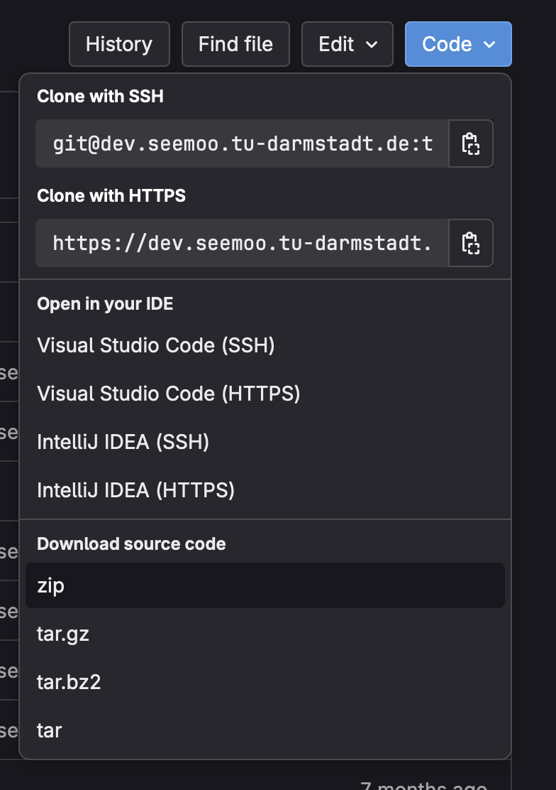

# SEEMOO Thesis Template

[](https://dev.seemoo.tu-darmstadt.de/templates/seemoo-thesis-template/-/tree/master)
[](https://dev.seemoo.tu-darmstadt.de/templates/seemoo-thesis-template/-/jobs/artifacts/master/file/Thesis.pdf?job=build)

This is a LaTeX template to be used for all theses written at SEEMOO.
It's based on the [`classicthesis`](https://ctan.org/pkg/classicthesis)
package but includes some specific adjustments for SEEMOO and TU Darmstadt.
This README is supposed to get you started quickly, avoid frustration, and
let you spend more time for working on your actual project.

*If you have a bug fix or general improvment, don't keep them to yourself but create a pull request!*

## Structure

The source directory is structured as follows:

* `Appendicies/` -- contains additional appendix chapters (e.g. questionnaires, long proofs)
* `Acronyms.tex` -- contains a list of acronyms
* `AdditionalPackages.tex` -- to include and configure packages
* `AuthorPublications.bib` -- contains auhtor publications for PhD theses
* `Bibliography.bib` -- contains all your bibtex references
* `Chapters/` -- contains your thesis' main chapters.
* `ClassicThesisConfig.tex` -- can be adjusted to your needs
* `Graphics/` -- for figures and graphics
* `Hyphenation.tex` -- custom rules if LaTeX screws up hyphenation
* `Macros.tex` -- custom commands, e.g., symbols or often used expressions.
* `PersonalInfo.tex` -- must be adjusted by you.
* `Thesis.tex` -- the main file, where you should include additional chapters
* `Classicthesis.sty` -- the `classicthesis` style file (don't change).

Some helpers exist:
* `make.bat` and `Makefile` for Windows and UNIX, respectively.
* `dockmake.sh to invoke make through a docker latex container.

## Configuration

There are several configuration parameters that you need to adjust.
We try to litter them with comments of the form `% -- TemplateKnob`
so you can search for settings meant to be adjustable.

### Meta data

Adjust all the `\my<X>` variables in [`PersonalInfo.tex`](./PersonalInfo.tex),
such as your name and title of your thesis.

### AI Declaration

Make sure to ajust the AI declaration in `FrontBackmatter/AIDeclaration.tex`. 

### Style

You can choose between different styles for your thesis.
You can enable them by uncommenting the respective `\toggletrue{<X>}`
calls in [`Thesis.tex`](./Thesis.tex) Currently, these are:

* **Less margins.** The `adrianstyle` (called so for historic reasons)
	will reduce the page margins, effectively increasing the space for
	text and floats. Don't use margin notes together with this mode.
* **Use parts.** The `parts` toggle will add another layer of structure
	to your thesis. Only use this if your thesis is particulary long or
	additional structure makes sense.
* **PhD thesis.** The `phd` toggle adds additional front and back matter
	pages to the template that are relevant if you write a PhD thesis.

### Drafting mode

To enable a drafting mode (prints date, version number, and git commit hash in footer),
set the `drafting` option in [`ClassicThesisConfig.tex`](./ClassicThesisConfig.tex) to `true`.

To display the git commit hash, you have to install and trigger the
[`gitinfo2`](https://ctan.org/pkg/gitinfo2) hooks once via

```bash
make gitinfo2-hooks
git checkout master
```

## Build

You can use your IDE of choice, directly invoke make, or use the docker wrapper

```bash
# Note: <target> is the make target, leave out for 'all'
# Build natively via make
make $target

# Call make wrapped in docker container
./dockmake.sh $target
```

The output file will be in `Thesis.pdf`

## Windows

If you are using Windows, you **must** run `make` once for the Bibliography to compile correctly. Make sure to install `perl` to ensure the commands can execute properly.


## Overleaf / TU Sharelatex

The recommendations for Overleaf are the same as for the TU Sharelatex. We just use the term "Overleaf" here. 

### Uploading 
1. Go to our thesis [git repository](https://dev.seemoo.tu-darmstadt.de/templates/seemoo-thesis-template).
2. Click the `Code` button on the top right.
3. Select `zip`. (see image below)
4. Open your Overleaf / TU Sharelatex.
5. Click the `New Project` button on the top left.
6. Select `Upload Project`. 
7. Upload the ZIP downloaded from our Git repository. 

GitLab zip Download:  
  

Creating a new project:  


### Building 
You can build the project normally with Overleaf. 

### Acronyms (or something else) does not work
In that case, you did something wrong when uploading. For some reason, Overleaf does not like it when your root Tex file is **not** in the root folder. When uploading, make sure that you do not zip a folder which contains your project, but all files. 
For example, selecting the folder that you want to upload on macOS, right clicking and then uploading it will fail. 